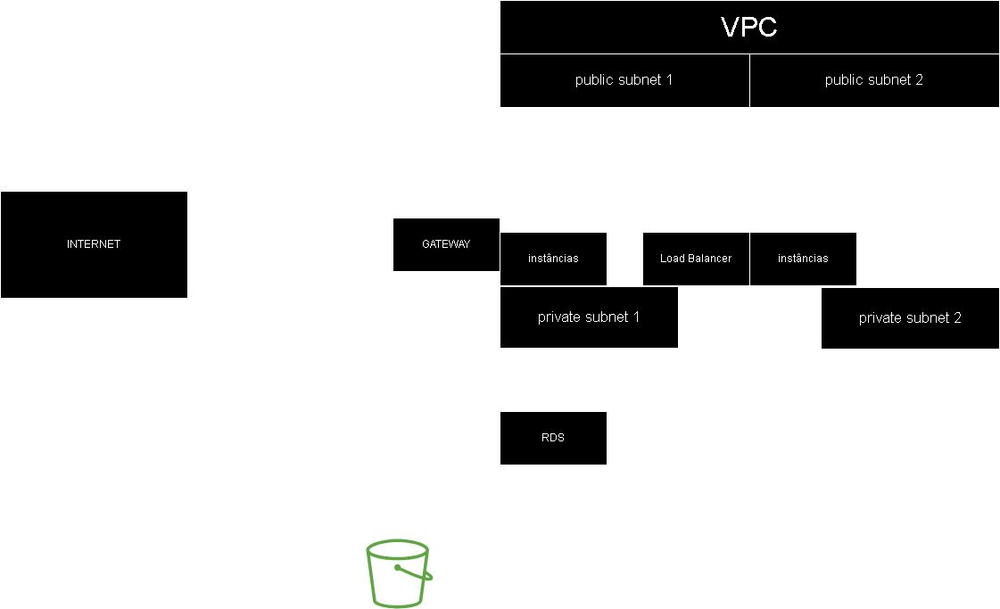

# ProjetoCloud23_2

## Aluno: Guilherme dos Santos Martins

### Introdução
Este guia aborda a criação de uma infraestrutura robusta e escalável na AWS, especialmente indicada para aplicações web que exigem elevada disponibilidade e desempenho. Através do uso do Terraform, uma ferramenta de orquestração de infraestrutura como código, o documento oferece uma visão detalhada da implementação de serviços fundamentais, incluindo Elastic Load Balancer (ELB), Auto Scaling Groups (ASG) e Amazon Relational Database Service (RDS). A arquitetura foi meticulosamente planejada para acomodar tráfego variável e assegurar a resiliência da aplicação.

### Configuração do Provider (provider.tf) 
**AWS Provider**: A integração com a AWS usando o Terraform é concretizada ao definir o AWS Provider, uma configuração crucial para acessar e administrar a extensa variedade de recursos disponíveis na AWS. A escolha da região us-east-1 foi feita devido à sua vasta oferta de serviços e infraestrutura altamente confiável, além de proporcionar vantagens financeiras em comparação com outras regiões.

**Backend S3**: 
A adoção de um bucket S3 como backend para o Terraform representa um método eficaz para armazenar e supervisionar o estado da infraestrutura. Além de simplificar o controle de versão, essa abordagem proporciona camadas adicionais de segurança e possibilita a colaboração entre equipes sem preocupações com conflitos de estado, garantindo uma gestão de infraestrutura mais integrada e eficiente.


### Load Balancer (load_balancer.tf) 
**Application Load Balancer (ALB)**: 
O Application Load Balancer (ALB) desempenha um papel central na administração e distribuição do tráfego de entrada entre as instâncias EC2. Especialmente adequado para aplicações que utilizam HTTP/HTTPS, o ALB oferece funcionalidades avançadas, incluindo o roteamento baseado em conteúdo. Essa característica possibilita uma distribuição mais inteligente do tráfego, aprimorando a eficiência do sistema.

**Target Group**: 
O Target Group é configurado com uma verificação de integridade (health check), garantindo que apenas instâncias saudáveis estejam aptas a receber tráfego. Essa prática não apenas aprimora a confiabilidade e disponibilidade da aplicação, mas também habilita uma resposta mais ágil a possíveis problemas que possam surgir nas instâncias.

**Listener**: 
O listener no Application Load Balancer (ALB) é ajustado para garantir que as requisições na porta 80 (HTTP) sejam redirecionadas para o target group correspondente. Essa configuração é essencial para uma administração eficiente e segura do tráfego de entrada.


### Auto Scaling (autoscaling.tf)
**Launch Template**: O template de lançamento estabelece os parâmetros das instâncias EC2, tais como a imagem da máquina Amazon (AMI) e o tipo de instância. O script de inicialização incorporado no template configura automaticamente as instâncias com todas as dependências requeridas e inicializa a aplicação, promovendo assim a padronização e uma inicialização eficiente das novas instâncias.

**Auto Scaling Group (ASG)**: 
O Auto Scaling Group (ASG) desempenha um papel crucial na escalabilidade da aplicação, ajustando automaticamente o número de instâncias EC2 em resposta à demanda. Essa abordagem assegura que a aplicação mantenha um desempenho estável e responsivo diante de diversas cargas de trabalho. O ASG também é configurado para distribuir as instâncias em diferentes zonas de disponibilidade, garantindo resiliência à aplicação em caso de falhas.

**CloudWatch Alarms**: 
Os alarmes do CloudWatch são configurados para monitorar métricas críticas, como a utilização da CPU. Esses alertas capacitam o Auto Scaling Group (ASG) a ajustar dinamicamente o número de instâncias, assegurando que a aplicação permaneça otimizada para a demanda atual.

### Database (database.tf) 
**RDS Instance**: 
A instância RDS é configurada para utilizar MySQL, com ênfase em alta disponibilidade e segurança dos dados. Recursos essenciais, como backups automáticos e a opção Multi-AZ, são configurados para assegurar a continuidade dos negócios e uma rápida recuperação em situações de falha. Além disso, a instância RDS é posicionada nas subnets privadas, garantindo que ela não seja acessível pela Internet.

### Rede (network.tf e routes.tf) 
**VPC e Subnets**:


A configuração da Virtual Private Cloud (VPC) e das subnets constitui a fundação da rede. A VPC oferece isolamento para os recursos da AWS, enquanto as subnets públicas e privadas são empregadas para a organização dos recursos de acordo com a necessidade de acesso externo.

As subnets públicas são configuradas para permitir o acesso à Internet, ao passo que as subnets privadas são ajustadas para permitir o acesso exclusivamente à VPC. Essa configuração é fundamental para garantir a segurança e o isolamento da rede interna.


**Internet Gateway e Route Tables**: 
O Internet Gateway possibilita a comunicação entre a VPC e a Internet. As tabelas de rotas são configuradas para garantir o encaminhamento adequado do tráfego na VPC, sendo um elemento crucial para o funcionamento efetivo de uma rede AWS.

### Security Groups (security_groups.tf) 
**EC2, ALB e RDS Security Groups**: A configuração dos grupos de segurança é realizada com precisão para regular o acesso a recursos como EC2, ALB e RDS. Essas configurações são cruciais para a proteção da infraestrutura contra acessos não autorizados e potenciais ameaças.

O Security Group para as instâncias EC2 é configurado para permitir o tráfego HTTP e SSH, enquanto o Security Group para o ALB é configurado para permitir o tráfego HTTP e HTTPS. O Security Group para o RDS é configurado para permitir o tráfego MySQL exclusivamente das instâncias EC2, garantindo que somente essas instâncias tenham acesso ao banco de dados.

### Outputs (outputs.tf) 
**Output de Documentação**: 
Este resultado disponibiliza um link para a documentação detalhada da aplicação, simplificando o acesso a informações importantes para o usuário.


``` terraform
output "lb_endpoint" {
  value = "http://"+aws_lb.my_alb.dns_name+"/docs"
}
```

### Guia Passo a Passo 
1. **Pré-requisitos**: Certifique-se de que o Terraform e a AWS CLI estejam instalados e suas credenciais estão configuradas
2. **Criação do Bucket S3**: Estabeleça um bucket S3 para armazenar o estado do Terraform e atualize o nome do bucket no arquivo provider.tf, no bloco backend "s3" no campo bucket.
3. **Inicialização do Terraform**: Prepare seu ambiente com `terraform init`.
4. **Aplicação do Terraform**: Implemente a infraestrutura com `terraform apply -auto-approve`.
5. **Validação**: 
Após a aplicação, utilize o link de output (link_to_docs) para acessar a documentação da aplicação e verificar se está operando corretamente.
6. **Destruição da Infraestrutura**: Destrua a infraestrutura com `terraform destroy -auto-approve`.

### Diagrama da Infraestrutura
